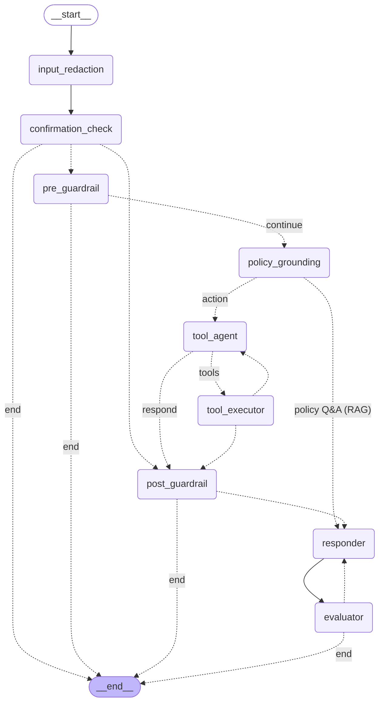

# AtlasCare — Architecture Document

## 1. System Overview

AtlasCare is a production-grade Agentic AI layer for Acme Retail's customer support platform. It handles Tier-1 queries autonomously — order tracking, cancellations, refunds, and policy questions across 14 product categories — while safely escalating anything it should not resolve on its own.

**Core design principle: Deterministic > Generative.**
The LLM is used only where intelligence is genuinely valuable (intent extraction, natural language phrasing). All policy enforcement, arithmetic, ownership checks, and business rules live in deterministic Python code.

---

## 2. Architecture Layers

```
HTTP Request (POST /query)
        │
        ▼
┌─────────────────────────────────────────────────────┐
│                    main.py                          │
│  FastAPI endpoint — timing, session wiring, trace   │
└───────────────────┬─────────────────────────────────┘
                    │
                    ▼
┌─────────────────────────────────────────────────────┐
│               agent/graph.py  (LangGraph)           │
│  Compiled StateGraph — wires all pipeline nodes     │
│                                                     │
│  pre_guardrail → tool_agent → tool_executor         │
│       └─(blocked)→ END         │                   │
│                                ▼                   │
│                         post_guardrail              │
│                       └─(blocked)→ END             │
│                                │                   │
│                                ▼                   │
│                           responder → END           │
└──────────────────────┬──────────────────────────────┘
                       │  tool_executor calls
          ┌────────────┼────────────┬────────────┐
          ▼            ▼            ▼            ▼
     oms_tool.py  crm_tool.py  payment_tool.py  kb_tool.py
          │
    ┌─────┼─────┐
    ▼     ▼     ▼
order_  crm_  payment_  kb_
repo    repo   repo     repo
    │
  data/*.json  (JSON-backed, atomic writes)
```

### 2.1 Agent Graph (LangGraph)

The compiled `StateGraph` wired in `agent/graph.py::build_graph()`, rendered directly from the live graph via `get_graph().draw_mermaid()`. Solid arrows are unconditional edges; dotted arrows are conditional routes (labelled with the branch taken).



**Node roles:**
- `input_redaction` — the real front door; deterministically masks card/CVV/email/phone before the message reaches history, the model, or any log.
- `confirmation_check` — resolves a pending high-value confirmation from a prior turn before anything else.
- `pre_guardrail` — deterministic policy before the model (§6): over-limit refunds, fraud/safety escalation, order-ID format, ambiguous-query check.
- `policy_grounding` — splits **Q&A from actions**. A general policy question is answered straight from the knowledge base — scoped to the in-context order's product **category** — and skips the planner entirely. An order action falls through to `tool_agent`.
- `tool_agent` / `tool_executor` — select and run tools; `tool_executor` may loop back to `tool_agent` for a follow-up call (e.g. get_order → cancel_item).
- `post_guardrail` — last money-safety net after tools run (§6).
- `responder` — phrases the reply from verified tool results (or grounded policy text), never the customer's unverified claims.
- `evaluator` — an LLM judge that checks the reply and can route back to `responder` for exactly one retry.

To regenerate this diagram: `build_graph().get_graph().draw_mermaid()`.

---

## 3. Request Pipeline

| Step | Node | Model | What happens |
|------|------|-------|--------------|
| 1 | main.py | — | `session_id` → `customer_id` via SessionStore |
| 2 | `input_redaction` | — (code) | Masks card/CVV/email/phone before history, model, or logs |
| 3 | `pre_guardrail` | — (code) | GR-001/002/003 checks; order ID format; history-aware ambiguous-query check |
| 4 | `policy_grounding` | — (code) | General policy question → fetch matching KB articles (by tag **and** the in-context order's category), route straight to `responder`; otherwise continue to the planner |
| 5 | `tool_agent` | **Llama 3.3 70B** (complex) or **8B** (simple) | Selects tools to call, or writes a direct reply |
| 6 | `tool_executor` | — (code) | Dispatches each tool call with ownership validation |
| 7 | `post_guardrail` | — (code) | GR-004: verifies no payment on escalation case |
| 8 | `responder` | **Llama 3.1 8B Instant** | Formats tool results / grounded policy into a natural reply |
| 9 | `evaluator` | **Llama 3.3 70B** | Judges the reply against the results; allows one retry |

For a general policy question, `policy_grounding` answers from the knowledge base and **skips the planner and tools entirely** — one grounded call, not a tool loop.

For no-tool requests (greetings, chitchat), `tool_agent` writes a direct reply and the pipeline skips `tool_executor` → `post_guardrail` → goes straight to `responder`.

For escalations, `responder` uses a deterministic template (no LLM call).

---

## 4. LLM Model Routing

Two Llama models are used via the Groq API (OpenAI-compatible endpoint). Using both is intentional — planning accuracy and response latency have different requirements.

| Pipeline node | Model | Rationale |
|---|---|---|
| `tool_agent` — complex queries | **Llama 3.3 70B Versatile** | Multi-step tool selection; accuracy matters |
| `tool_agent` — simple queries | **Llama 3.1 8B Instant** | Single-intent lookups; speed matters |
| `responder` — tool-using paths | **Llama 3.1 8B Instant** | Formats verified data; reasoning depth not needed |
| `responder` — escalation | — (deterministic template) | Consistent, auditable output |
| `responder` — no-tool path | — (reuse tool_agent output) | Avoids a second LLM call entirely |

Complexity classifier (`_is_complex`): messages containing escalation signals (damaged, fraud, lawsuit, etc.) or two or more action verbs (cancel + refund) route to the 70B model.

**Config**: `PLANNER_MODEL` and `RESPONSE_MODEL` env vars — set in `.env`, pointing to `api.groq.com/openai/v1`.

---

## 5. Tool Design

Tools are typed async interfaces. They are the **only** layer that touches repositories. Agent code never accesses JSON files directly.

| Tool | Key methods | Backed by |
|------|------------|-----------|
| OmsTool | get_order, list_orders, cancel_item, update_shipping_address | OrderRepository |
| CrmTool | get_customer, create_case, get_cases | CrmRepository |
| PaymentTool | process_refund | PaymentRepository |
| KbTool | search, get_article | KbRepository |
| CategoryRepository | category_for_product, categories_for_order, policies_for_category | product_categories / category_policies |

Tools are swappable — replacing JSON repos with REST APIs requires only changing the repository layer.

### 5.1 Policy retrieval (RAG), by tag **and** category

A general policy question is answered from the knowledge base, not the model's memory. `policy_grounding` maps the question to KB tags and retrieves matching articles. When an order is in context, it also resolves that order's product **category** (via `product_categories.json`) and keeps only the articles whose `applies_to` includes it. So "what's the return window?" returns the **electronics** policy (7 days) for a headphones order but the **apparel** policy (30 days) for a saree.

One subtlety: the category filter runs over the *full* tag-matched candidate set before truncating to the top results — otherwise a category's article that ranks low on tags alone (a `return`-only beauty article vs. generic `return`+`window` ones) would be cut before the filter could select it. Articles are ranked by tag-match count, then precision (share of the article's own tags that matched), then a stable id — not edit-recency.

---

## 6. Guardrails (Defence in Depth)

Three independent layers enforce the Rs.25,000 threshold:

| Layer | Where | When |
|-------|-------|------|
| GR-001 | `pre_guardrail` node | Before LLM — regex extracts amount from message |
| `PaymentTool._enforce_threshold` | payment_tool.py | At call time — Decimal comparison |
| GR-004 | `post_guardrail` node | After execution — verifies no payment on escalation case |

**Rule inventory:**
- GR-001: High-value refund mention → block + escalation message
- GR-002: Empty message → reject
- GR-003: Message > 2,000 chars → reject (prompt injection defence)
- GR-004: Payment success + escalation case in same turn → critical block
- AQ: Ambiguous order reference ("my order", "the order", etc.) with no `ORD-XXXXX` in the current message → prompt the customer for their order ID. **Bypassed** when a valid order ID already appears anywhere in the conversation history, so follow-up questions in multi-turn sessions pass through correctly.

---

## 7. Observability

Every request produces a `Tracer` with:
- `trace_id`: `trc-<12 hex chars>` — unique per request
- `tool_calls[]`: ordered record of every component invoked (model calls, tool calls, guardrail triggers)

Structured JSON logging (`LOG_FORMAT=json|text`) emits every log line as a parseable JSON object.

The `TraceStore` is an in-memory ring buffer (last 500 traces) exposed via `/admin/traces` and `/admin/kpis`.

---

## 8. Security

- **Ownership enforcement**: `order.customer_id == session_customer_id` checked before every tool mutation. Implemented in `agent/graph.py:_assert_ownership()`.
- **Error opacity**: `OwnershipError` returns `"Order not found"` — never reveals the real owner.
- **Session ID validation**: Pydantic regex `^[a-zA-Z0-9_\-]+$` rejects injection characters at the HTTP boundary.
- **No authentication (by spec)**: Session store maps `session_id → customer_id` via `data/sessions.json` and an embedded-pattern extractor for auth-generated sessions.

---

## 9. Data Layer

All data is stored in JSON files under `data/`. Repositories maintain in-memory indexes (O(1) lookup) and flush to disk atomically using write-to-temp + `os.replace()` to prevent corruption.

**Canonical (you supply these four — the only inputs):**

| File | Repository | Access |
|------|------------|--------|
| `orders.json` | OrderRepository | read/write |
| `crm_cases.json` | CrmRepository | read/write |
| `kb_articles.json` | KbRepository | read-only |
| `payment_config.json` | PaymentRepository | read-only |

**Derived on startup** (`data/derive_support_files.py`, a pure function of the four above):

| File | Repository | Notes |
|------|------------|-------|
| `users.json` | UserRepository | one login per customer |
| `sessions.json` | SessionStore | one session per customer |
| `refunds.json` | PaymentRepository | append-only ledger, never overwritten |
| `order_audit_log.json` | AuditRepository | append-only ledger, never overwritten |
| `category_policies.json` | CategoryRepository | category → applicable policy articles (inverts `applies_to`) |
| `product_categories.json` | CategoryRepository | product → category (deterministic keyword classifier) |

The category **vocabulary is read from `kb_articles.applies_to`** — never hardcoded. Products are classified by a deterministic keyword cross-check (no LLM, so it is reproducible and needs no network at boot); anything unmatched falls to `misc`.

---

## 10. API Endpoints

| Method | Path | Purpose |
|--------|------|---------|
| POST | `/query` | Submit a customer message to the agent |
| GET | `/health` | Liveness probe |
| POST | `/cases` | Create a CRM support case directly |
| GET | `/kb/search?tags=...` | Search KB articles by comma-separated tags |
| GET | `/admin/traces` | Fetch recent request traces |
| GET | `/admin/kpis` | Fetch KPI summary |
| DELETE | `/session/{session_id}` | Clear server-side session history |
| POST | `/auth/login` | Authenticate user, receive session_id |
| POST | `/auth/register` | Register a new user account |
| POST | `/auth/request-otp` | Request a password-reset OTP |
| POST | `/auth/reset-password` | Reset password with OTP |

---

## 11. Known Limitations

- JSON-backed storage is not suitable for concurrent multi-process deployments. Production would use PostgreSQL or DynamoDB.
- Session store is a simulation. Production would integrate with OAuth/JWT.
- `MemorySaver` checkpointer stores conversation history in-process memory only — restarting the server clears all histories.
- LLM calls are not circuit-broken. Production would add timeout budgets and fallback paths.
